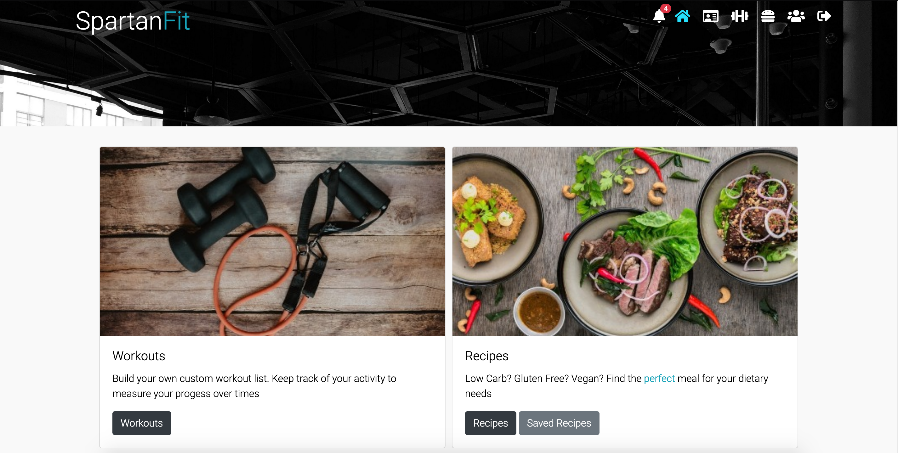
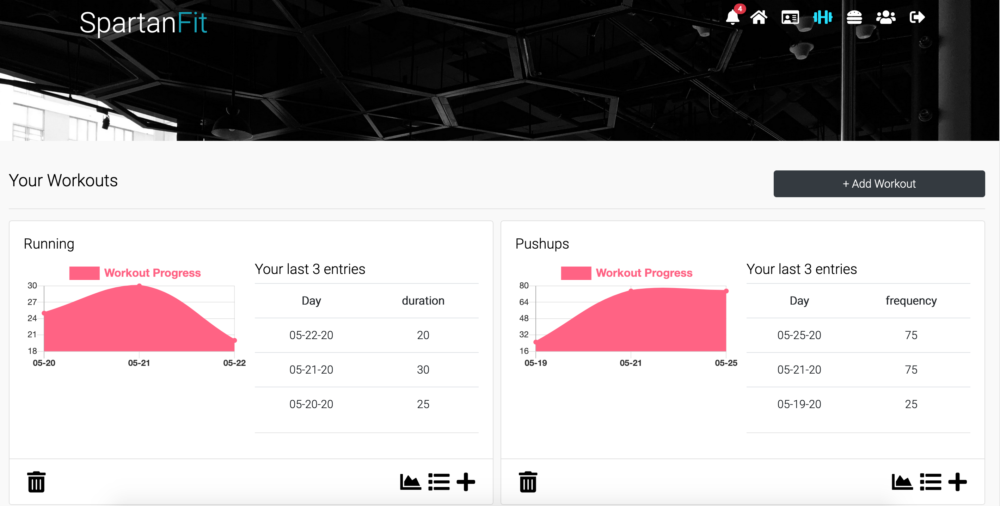
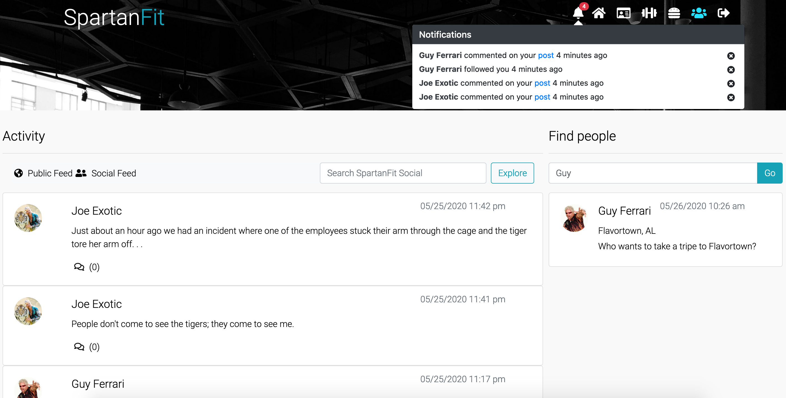
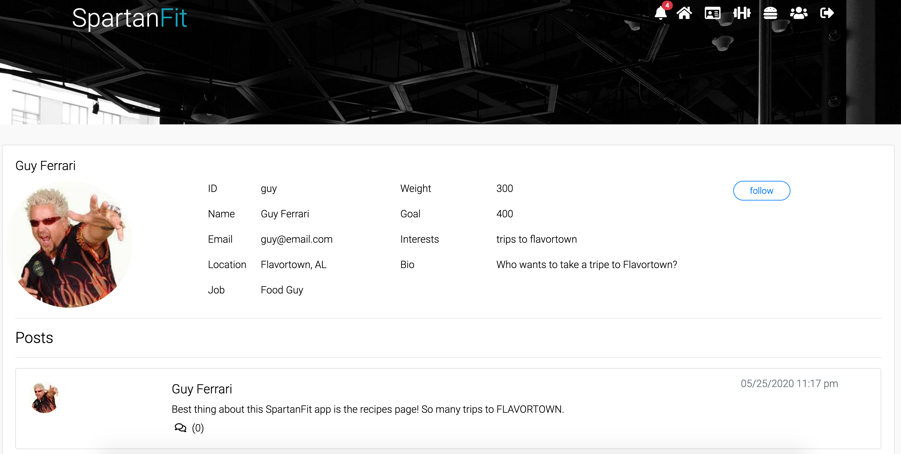

# SpartanFit

SpartanFit is a MERN Stack Fitness and social media application.

SpartanFit uses data-based progress monitoring to help you reach your fitness goals.
With our easy-to-use interface, set up and track your progress on your workouts and set up the perfect diet plan.

## Demo login

- username: user
- password: password

Deployed at: https://spartanfitness.herokuapp.com/

# Homepage

# Workouts

# Recipes

# Social

# Profile

## Technologies used

- MongoDB
- Express.js
- React.js
- Node.js
- JSX
- JavaScript
- CSS
